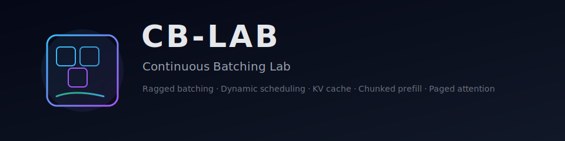

<p align="center">
  
</p>

# cb-lab
A tiny learning framework that re-implements the core ideas behind modern continuous batching inference engines (prefill + decode, ragged batching, KV cache, paged attention).

## 1. Overview
cb-lab is intentionally small and transparent. The goal is clarity, not performance:

- KV cache and chunked prefill for long prompts
- Ragged batching (no padding) with explicit causal masks
- Token-level dynamic scheduling that mixes prefill and decode in one step
- Paged attention style KV layout for the decode fast path

Every component is debuggable and printable so you can see exactly how continuous batching works end-to-end.

## 2. Repository structure
```
cb_lab/           # library code
  core/           # request lifecycle, scheduler, KV cache, ragged batch builder
  attention/      # dense, ragged, and paged attention helpers
  model/          # TinyLLM single-layer attention block
demos/            # runnable scripts that visualize each concept
tests/            # lightweight correctness checks
```

## 3. Quick start
Create a virtual environment with Python 3.9+ and install dependencies:
```bash
python -m venv .venv
source .venv/bin/activate  # Windows: .venv\\Scripts\\activate
pip install -r requirements.txt
```

Run a demo to see ragged masking:
```bash
python -m demos.demo_ragged_mask
```

Mix prefill + decode with the scheduler:
```bash
python -m demos.demo_prefill_decode_mix
```

Run the tiny test suite:
```bash
pytest tests
```

## 4. Documentation
- [docs/get_started.md](docs/get_started.md)
- [docs/architecture.md](docs/architecture.md)
- [docs/continuous_batching.md](docs/continuous_batching.md)
- [docs/principle_recipes.md](docs/principle_recipes.md)
- [docs/learning_plan.md](docs/learning_plan.md)
- [docs/interview_questions.md](docs/interview_questions.md)
- Learning materials per phase: `docs/learning_materials/`
- Chinese versions: `_zh` files in `docs/`

## 5. What’s implemented
- **Request lifecycle:** prefill chunks, decode tokens, and simple stopping when `max_new_tokens` is reached.
- **Dense + paged KV caches:** append-only storage; paged mode uses a tiny block allocator to mimic paged attention layouts.
- **Ragged batch builder:** concatenates prompt chunks and builds a boolean ragged causal mask so different sequences are isolated without padding.
- **Attention modules:** dense causal attention, ragged attention with an explicit mask, and paged decode attention over the cache.
- **TinyLLM model:** single-head attention with linear projections; exposes `forward_prefill_ragged` and `forward_decode`.
- **Continuous batching scheduler:** token-budget aware, mixes decode tokens with prefill chunks, and logs the shape/mask decisions at every step.
- **Demos:** cover prefill-only, ragged mask visualization, mixed prefill+decode timeline, and paged attention decode.
- **Tests:** sanity checks for masks, ragged metadata, scheduler completion, KV cache append, and paged decode.

## 6. Learning notes
- Ragged batching removes the batch dimension entirely; masking enforces isolation between sequences while keeping causal order within each request.
- Continuous batching keeps the GPU busy by always scheduling decode tokens first, then filling the remaining token budget with prefill chunks.
- Paged attention stores KV in fixed-size blocks; this repo uses a minimal allocator to show the data layout without any CUDA kernels.

Enjoy experimenting—every file is short enough to step through with a debugger or print statements.

---

**Note:** Most project code and documentation here were generated with assistance from Codex and GLM 4.6.
